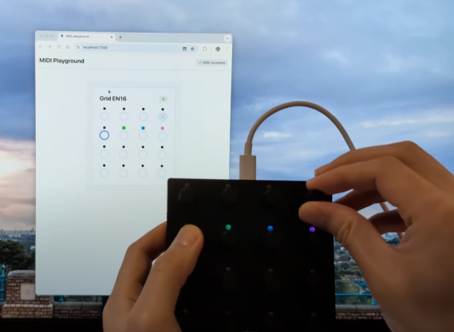
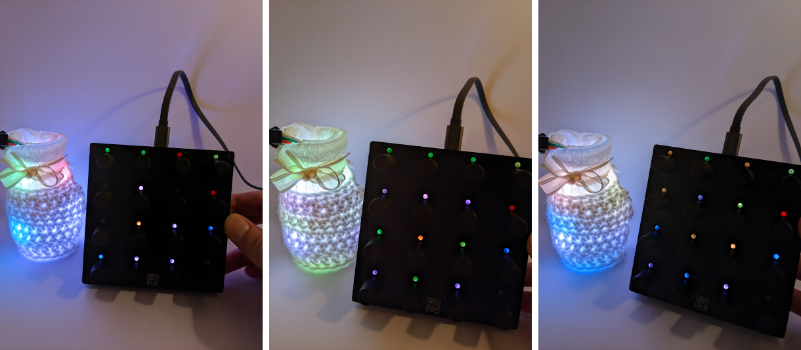

# MIDI Playground

A playground for MIDI devices (and potentially more).

## Current Status

The plan is to create a library for experimenting with MIDI controllers and potentially other types of controllers - [anything other than keyboard and mouse](https://www.forestinthetree.com/blog/magic-hands).

The MIDI playground works through the web browser and communicates with MIDI devices using [WebMIDI](https://developer.mozilla.org/en-US/docs/Web/API/Web_MIDI_API). It currently only supports [InTech Studio Grid](https://intech.studio/) (specifically the [EN16](https://intech.studio/shop/en16/) - a 4x4 grid of rotary encoders that are also buttons, and have corresponding RGB LEDs).

Here's an image of it in action:



It can:

* Detect MIDI support in the browser - shown on the top right
* Detect when MIDI devices are connected/disconnected - shown on the top right of the device block
* Receive MIDI messages for button presses - shown as highlighted rings
* Receive MIDI rotary encoder rotations - shown as `<<`, `<`, `>` and `>>` depending on the direction and how fast it is rotated 
* Send MIDI messages to change the RGB LED lights - controlled by clicking on the dot above the control, and using the color picker


It is built with:

* [Astro](https://astro.build/) + [React](https://react.dev/) for the the webapp, with the core `createMIDIManager.ts` being framework agnostic
* [Radix UI](https://www.radix-ui.com/) for UI components

This is more a proof of concept and an attempt to flesh out an API, than something you would use as is. It's intended for internal explorations, but feel free to dig into the code for inspiration.

## Examples of Usage


_[Exploring a screen-less interface for controlling light](https://youtube.com/shorts/YFvK7kcCoTo?feature=share)_

More projects at [Forest in the Tree](https://www.forestinthetree.com/).

## Setup of EN16

Receiving MIDI messages from the EN16 works by just plugging the device into your computer, but to send MIDI messages for the LEDs, a message format was created to be able to send more data than single MIDI messages can handle.

To be able to handle this message format, you need to use the [Grid Editor](https://docs.intech.studio/guides/grid/grid-basic/editor-110/), to upload the following code: [Change EN16 RGB using MIDI RX](grid-editor://?config-link=THAiOt3JRQNkyOryhq6Y).

### How Sending Messages Work

Each RGB LED command is split into 3 [MIDI RX](https://docs.intech.studio/wiki/events/system-events/midirx-event/) messages - one for each color: red, green and blue.

Each MIDI message is in the format: `[cmdLayer, ccValue, lightValue]`

* `cmdLayer` is in the format `176 + layer` where layer is 1 or 2 (layers can be used to blend colors using the software on the device, but there is only 1 hardware LED, so for simple use cases, using either layer is fine)
* `ccValue` is `baseCCNumber + rgbIndex`
  * `baseCCNumber` is `STARTING_CONTROL_CHANGE_NUM + index * 3` where `STARTING_CONTROL_CHANGE_NUM` is 20 by default^, and index is the `index` of the element ie, 0-15
  * `rgbIndex` is 0 for red, 1 for green, and 2 for blue
* `lightValue` is the light value from 0-127. Although there are potentially 256 values for light value, it was scaled by half, to simplify the number of messages needed to be sent

^ `STARTING_CONTROL_CHANGE_NUM` can also be set by `gstartcc` in Element 16 (System) Init Global

## Development

1. Install dependencies: `npm install`
1. Run dev server: `npm run dev`

### Linting/Formatting

This project uses [Biome](https://biomejs.dev/) for linting and formatting. If using VSCode, it should be set up if the [official biome extension](https://biomejs.dev/reference/vscode/) is installed.

To manually check for issues:

```
npm run biome:check
```

To fix issues:

```
npm run biome:fix
```

## License

MIDI Playground is open source under the [GNU Affero General Public License Version 3 (AGPLv3)](https://www.gnu.org/licenses/agpl-3.0.en.html) or any later version.

If you contribute to the project, you agree that your contributions will also be licensed under the AGPL v3 License.

If you have any queries, feel free to email [licenses@forestinthetree.com](mailto:licenses@forestinthetree.com).